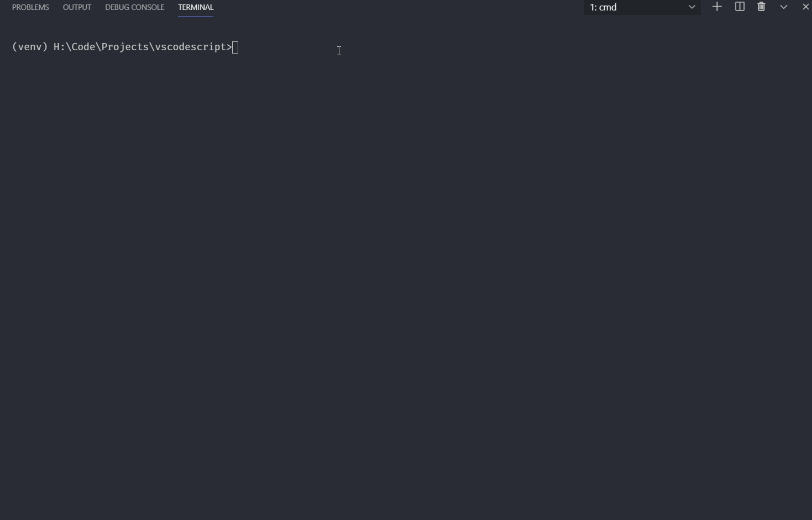

# ***codescript***
Personal automation cli app for ease of opening projects/playground workplaces in VScode and various other utilities. All you have to do is Win+R then `vs project somename` and done.  
  
*Note: Only tested on Windows but should work on other platforms.*

## Requirements
- Python 3.6+

## Getting Started
- Clone the repo or click [here](https://github.com/Kandeel4411/Vscodescript/archive/master.zip) to download the zip file then extract it locally.
- Add the cloned repo directory to `PATH` Environment variable.
- Open the cloned repo in the terminal and run `pip install -r requirements.txt`.
- Run `vs` in terminal if on Windows or `vs.py` otherwise.

## Personal development
- [Install Make](http://gnuwin32.sourceforge.net/packages/make.htm) if you're on Windows. OSX already has it installed. Linux will tell you how to install it (i.e., `sudo apt-get install make`)
- [Install Poetry](https://github.com/python-poetry/poetry) for managing dependencies or just use python's `pip`.
  - If you want to disable poetry's `venv` creation run `make venv PY_VENV=false`.
  - If you want to add a new dependency run `make install DEP_NAME="<name>"` and replace `<name>` with the dependency's name.
  - if you want to export the updated dependencies to a `requirements.txt` file, run `make update-deps`.

## License
- MIT
